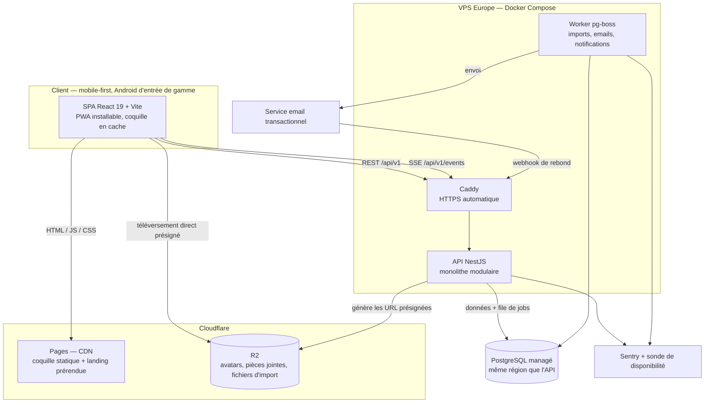
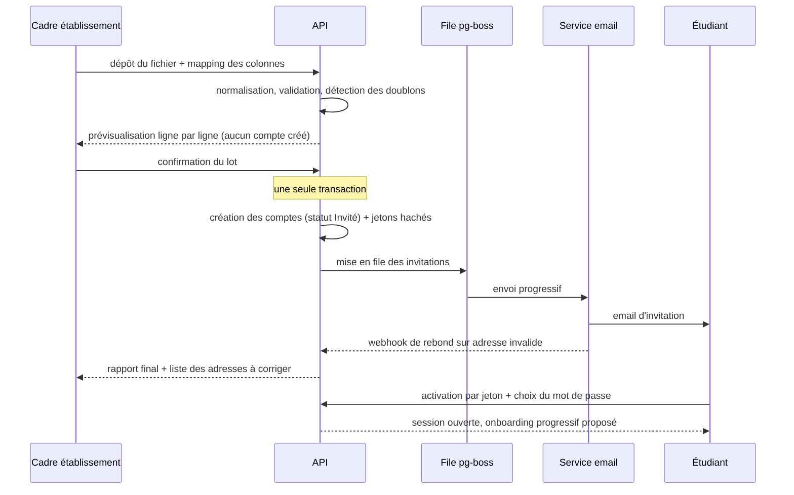
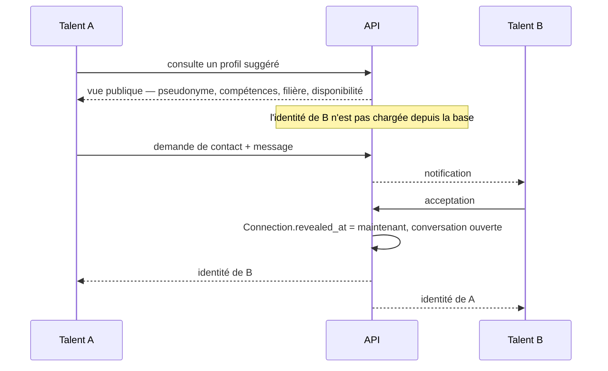
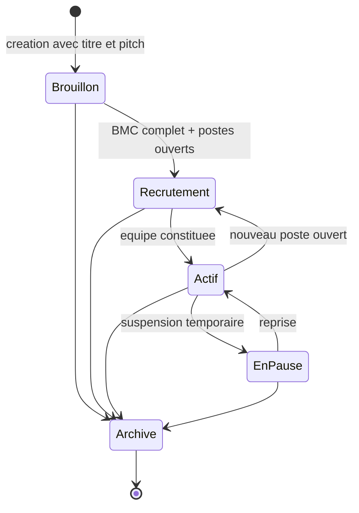

# Architecture — CoFound.mg

**Version** : 1.0 — 20 août 2026
**Documents liés** : [`stack-technique-et-justifications.md`](./stack-technique-et-justifications.md) · [`modele-de-donnees.md`](./modele-de-donnees.md)

---

## 1. Architecture globale



### Ce que chaque arête décide

| Arête | Pourquoi elle est là |
|---|---|
| `SPA → CDN` | La coquille de l'application ne traverse pas l'océan Indien à chaque visite. **La seule optimisation de latence qui ait un effet réel dans le contexte malgache** — et elle est gratuite. |
| `SPA → R2` en direct | Un téléversement de photo ne consomme ni notre bande passante ni un worker. L'API se contente de signer l'autorisation. |
| `SPA ← SSE` | Un seul flux HTTP pour les notifications et les nouveaux messages, avec reconnexion native. Pas de connexion bidirectionnelle, pas de sessions collantes. |
| `API → DB` pour la file de jobs | pg-boss stocke les traitements dans PostgreSQL, ce qui permet de créer 500 comptes et de mettre en file 500 invitations **dans la même transaction**. Si elle échoue, il n'y a ni comptes orphelins ni emails partis. |
| `Mail → Caddy` (webhook) | La boucle qui transforme une contrainte technique en fonctionnalité : les adresses invalides remontent dans le rapport d'import de l'établissement. |

**Un seul VPS au départ, deux processus** (API et worker) dans le même Compose. Le worker est
**déjà séparé** de l'API : le jour où les traitements pèsent, on le déplace sur sa propre
machine sans changer une ligne de code.

### Ce qui n'est délibérément pas sur ce schéma

Redis · moteur de recherche dédié · passerelle d'API · orchestrateur de conteneurs · bus de
messages.

Chacun résoudrait un problème que nous n'avons pas, en ajoutant un service **avec état** à
exploiter et à sauvegarder. Les conditions de leur introduction sont écrites dans
[`stack-technique-et-justifications.md`](./stack-technique-et-justifications.md) §12.

---

## 2. Découpage interne de l'API

```mermaid
flowchart LR
    subgraph Socle["Socle transversal — appliqué systématiquement"]
        Auth["auth<br/>sessions, jetons"]
        Rbac["rbac<br/>guards"]
        Privacy["privacy<br/>projections pseudonymes"]
        Audit["audit<br/>interceptor"]
        Notif["notifications"]
        Files["files"]
        I18n["i18n"]
    end

    subgraph Domaine["Modules métier — frontières étanches"]
        Identity["identity<br/>comptes, profils, affiliations"]
        Import["import<br/>lots, lignes, rapports"]
        Orgs["organizations<br/>capacités, membres"]
        Matching["matching<br/>Dream-Match"]
        Projects["projects<br/>BMC, membres, tâches"]
        Discovery["discovery<br/>feeds, recherche"]
        Opportunities["opportunities"]
        Messaging["messaging<br/>conversations"]
        Moderation["moderation<br/>signalements"]
        Finance["finance<br/>port seul, sans UI"]
    end

    Domaine --> Socle
```



### La règle structurante

> **Aucun module n'accède aux tables d'un autre.** Les échanges passent par les interfaces
> publiques des modules.

C'est la contrainte qui rendra l'extraction de `matching` ou de `notifications` possible en V2
sans démêlage.

### Les trois garanties critiques vivent chacune à un seul endroit

| Garantie | Où | Pourquoi là |
|---|---|---|
| **Autorisation** | `rbac` — un guard global, refus par défaut | Impossible d'oublier de protéger un endpoint : il faut **déclarer explicitement** une permission pour qu'il réponde. Un oubli rend l'endpoint inaccessible, pas ouvert. |
| **Masquage pseudonyme** | `privacy` — projections en couche d'accès aux données | La donnée privée n'est pas masquée, **elle n'est pas chargée** (voir `modele-de-donnees.md` §2) |
| **Journal d'audit** | `audit` — un interceptor | Une seule implémentation, appliquée par décoration |

---

## 3. Les deux flux qui définissent le produit

### 3.1 Import d'une promotion → activation d'un étudiant



> **Rien n'est créé avant la confirmation.** La prévisualisation est ce qui rend l'import
> réessayable sans dégât, donc utilisable par un service de scolarité sans compétence
> technique.

### 3.2 Rencontre et dévoilement



---

## 4. Machine à états d'un projet (MVP)



Cinq états au lieu des neuf du cahier des charges. `Recherche de mentorat`, `Recherche de
financement` et `Incubé` sont exclus du MVP avec leurs fonctionnalités respectives ;
`Abandonné` est fusionné dans `Archivé`, la distinction n'ayant aucune conséquence
fonctionnelle au lancement. **Les quatre états manquants s'ajoutent par une valeur
d'énumération, sans changement de schéma.**

> **La seule transition contrainte** : `Brouillon → Recrutement` exige un BMC complet. C'est
> l'arbitrage D6 rendu exécutable — la structuration est une porte vers la visibilité, jamais
> une barrière à l'entrée.

---

## 5. Rôles et permissions (MVP)

### Règle d'évaluation

```
autorisé  =  statut_du_compte_le_permet
          ET rôle_plateforme accorde
          ET (rôle_contextuel OU capacité_de_l_organisation) accorde
```

**Refus par défaut.** Un endpoint sans permission déclarée renvoie 403, jamais 200.

### Filtre préalable sur le statut du compte

| Statut | Accès |
|---|---|
| `INVITED` | Activation uniquement |
| `ACTIVE` | Selon les règles ci-dessous |
| `FROZEN` | Lecture de la notification de sanction, rien d'autre |
| `LEAVING` | Comme `ACTIVE`, **sorti du Dream-Match et du Feed Talents** |
| `ALUMNI` | Lecture, ses projets existants ; ne peut plus candidater |
| `DISABLED` | Aucun |

### Les axes de rôles

| Axe | Valeurs (MVP) |
|---|---|
| Plateforme | `TALENT` · `ORG_MEMBER` · `STAFF` |
| Dans l'organisation | `ORG_ADMIN` · `ORG_MANAGER` · `ORG_VIEWER` |
| Dans le projet | `OWNER` · `MEMBER` |
| Staff | `SUPER_ADMIN` · `OPS_ADMIN` · `MODERATOR` |

### Capacités d'organisation activées au MVP

| Capacité | Accordée à | Débloque |
|---|---|---|
| `CERTIFY_AFFILIATION` | **Établissements uniquement** | Import, gestion des affiliations et des statuts |
| `PUBLISH_OPPORTUNITY` | Établissements et partenaires | Publication d'appels à candidatures |
| `RECRUIT` | Partenaires | Recherche de projets et de talents, contact |

*Présentes dans le modèle, non activées au MVP* : `MENTOR`, `FUND`, `SURVEY`, `ANALYTICS`.

### Matrice de permissions

| Action | Talent | Établissement | Partenaire | Staff |
|---|---|---|---|---|
| Lire un profil — vue publique | ✅ | ✅ | ✅ | ✅ |
| **Lire l'identité d'un talent** | après dévoilement ou projet commun | **ses affiliés seulement** | après dévoilement | modérateur, sur signalement, **tracé** |
| **Lire le genre d'un individu** | soi uniquement | ❌ | ❌ | ❌ |
| Modifier son profil | ✅ | ❌ | ❌ | ❌ |
| Créer un projet | ✅ | ❌ | ❌ | ❌ |
| Modifier projet / BMC / tâches | `OWNER` / `MEMBER` | ❌ | ❌ | ❌ |
| Publier un projet (→ Recrutement) | `OWNER` + BMC complet | ❌ | ❌ | ❌ |
| Candidater à un projet | ✅ (non-membre) | ❌ | ❌ | ❌ |
| Traiter une candidature | `OWNER` | ❌ | ❌ | ❌ |
| Lire une conversation | participant | ❌ | ❌ | modérateur, sur signalement, **tracé** |
| Demander un contact | ✅ | ❌ | `RECRUIT`, **1 message, sans relance** | ❌ |
| Importer des étudiants | ❌ | `ORG_ADMIN` / `ORG_MANAGER` | ❌ | supervision |
| Changer un statut d'affiliation | ❌ | ses affiliés | ❌ | ✅ |
| Publier une opportunité | ❌ | `PUBLISH_OPPORTUNITY` | `PUBLISH_OPPORTUNITY` | ✅ |
| Rechercher des projets | ✅ | ses affiliés | `RECRUIT` | ✅ |
| Signaler | ✅ | ✅ | ✅ | — |
| Traiter un signalement | ❌ | ❌ | ❌ | `MODERATOR` |
| Geler / désactiver un compte | ❌ | ❌ | ❌ | `OPS_ADMIN` |
| Vérifier une organisation, accorder une capacité | ❌ | ❌ | ❌ | `SUPER_ADMIN` |
| Lire le journal d'audit | ❌ | ❌ | ❌ | `SUPER_ADMIN` |
| Exporter ses données | ✅ | ses données | ses données | ✅ |

### La fonction de visibilité de l'identité

C'est la règle la plus sensible du produit. Elle est écrite **une seule fois** et testée
exhaustivement.

```
peutVoirIdentite(observateur, cible) =
      observateur == cible
   OU connexion(observateur, cible).revealed_at != null
   OU projetCommunActif(observateur, cible)
   OU observateur est ORG_MEMBER d'une organisation
      ayant une affiliation certifiante ACTIVE sur cible
   OU observateur est MODERATOR agissant sur un signalement
      impliquant cible                    → écrit dans AuditLog

peutVoirGenre(observateur, cible) =
      observateur == cible
```

> Le genre n'est **jamais** dans la fonction d'identité. Un établissement voit les noms de ses
> étudiants — il les a fournis — et ne voit jamais leur genre individuellement. Il ne le lit
> qu'en agrégat, avec un seuil minimal de 5 individus.

### Les permissions négatives — des tests, pas des promesses

Ces sept assertions constituent une suite de tests dédiée. Chacune est une promesse
commerciale ou éthique dont la violation détruirait le projet.

1. Un cadre d'établissement ne peut lire aucune conversation, y compris celles de ses propres affiliés.
2. Un cadre d'établissement ne peut modifier ni supprimer aucun projet.
3. Un cadre d'établissement ne voit l'identité d'aucun talent affilié à une autre organisation.
4. Aucun rôle, staff compris, ne lit le genre d'un individu identifié.
5. Un partenaire ne voit l'identité d'aucun talent avant dévoilement mutuel.
6. Un talent ne voit ni le BMC, ni les tâches, ni le canal d'un projet dont il n'est pas membre — sauf les blocs de BMC explicitement rendus publics.
7. Un compte `FROZEN` n'accède à aucune ressource hors sa notification de sanction.

---

## 6. Budget de performance

Contrainte issue de C6, à vérifier en intégration continue :

| Métrique | Budget |
|---|---|
| JavaScript initial (gzip) | **< 200 Ko** |
| LCP en 3G lente, appareil bas de gamme | **< 2,5 s** |
| Poids d'une page de feed (données incluses) | **< 300 Ko** |
| Images téléversées | redimensionnées **côté client** avant envoi |

Un dépassement de budget fait échouer la CI. Sans contrainte automatique, un budget de
performance est une intention.

---

## 7. Environnements

| Environnement | Rôle | Données |
|---|---|---|
| `local` | Développement | Docker Compose : Postgres + API + web |
| `staging` | Recette, démonstrations | Jeu de démonstration reconstructible (`seed:demo`) |
| `production` | Lancement pilote | Données réelles, sauvegardes hors machine |

**Règle** : le jeu de démonstration est **reconstructible par une commande**. Une base de
démonstration bricolée à la main n'est reproductible ni pour une présentation, ni pour un
test.
