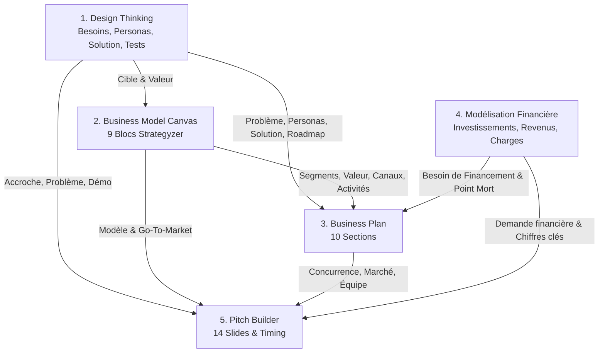

# Parcours Entrepreneurial & Boîte à Outils de Création d'Entreprise

Ce document présente l'architecture, la méthodologie et les outils intégrés à la plateforme **CoFound** pour permettre aux étudiants et équipes de bâtir progressivement leur projet entrepreneurial, de l'idée brute jusqu'au pitch devant investisseurs.

---

## 1. Principes Directeurs & Objet Central

1. **Le Projet comme objet central** : Tous les modules (Design Thinking, BMC, Business Plan, Finances, Pitch) sont rattachés directement au `Project` existant, évitant ainsi la fragmentation des données.
2. **Circulation ascendante et descendante des données** : Chaque outil alimente automatiquement les étapes suivantes, tout en permettant à l'équipe d'itérer et de mettre à jour le dossier en un clic.
3. **Rigueur méthodologique et attributions officielles** :
   - **IDEO / Stanford d.school** pour la démarche itérative centrée utilisateur en 5 phases.
   - **Strategyzer** (Alexander Osterwalder & Yves Pigneur) pour le Business Model Canvas officiel en 9 blocs.
4. **Indicateurs financiers transparents & fiables** : Modélisation explicite des marges, du seuil de rentabilité (point mort), du burn rate et du runway, avec alerte claire si des hypothèses sont manquantes.

---

## 2. Les 8 Étapes du Parcours de Maturité CoFound

Le score de maturité interne (0 à 100%) mesure l'avancement global et la solidité du dossier à travers 8 jalons clés :

| # | Étape | Outil Principal | Critères de Validation |
|---|-------|-----------------|------------------------|
| **1** | **Idée & Opportunité** | Fiche Projet | Titre, pitch initial et secteur définis |
| **2** | **Problème Défini & Utilisateurs** | Design Thinking (Phases 1-2) | Immersion terrain, personas créés, POV & HMW formulés |
| **3** | **Solution Conçue & Prototype** | Design Thinking (Phases 3-4) | Brainstorming noté, idée retenue, prototype & hypothèses définis |
| **4** | **Solution Testée & Validée** | Design Thinking (Phase 5) | Tests réels consignés, enseignements et décision (Persévérer/Itérer/Pivoter) |
| **5** | **Modèle Économique Structuré** | BMC Strategyzer | 9 blocs officiels renseignés à 100% |
| **6** | **Business Plan Rédigé** | Business Plan Guidé | 10 sections rédigées (complétion $\ge$ 75%) |
| **7** | **Viabilité Financière Analysée** | Modélisation Financière | Hypothèses de revenus et coûts complètes, seuil de rentabilité calculé |
| **8** | **Pitch Prêt & Répété** | Pitch Builder | Slides rédigées pour le format choisi, notes orateur prêtes |

> ℹ️ *Avertissement méthodologique : Le score de maturité est un indicateur interne à CoFound destiné à guider la progression pédagogique et pratique des équipes, sans prétendre à une valeur de prédiction financière absolue.*

---

## 3. Outil 1 : Design Thinking Itératif (IDEO / Stanford)

L'espace Design Thinking permet de mener des cycles itératifs successifs (*Itération 1*, *Itération 2*, etc.) à travers 5 phases guidées :

1. **Comprendre (Empathize & Understand)** :
   - Définition du problème sans préjuger de la solution.
   - Identification précise des utilisateurs cibles et contraintes de l'environnement malgache.
   - Journal des entretiens terrain : consignation des répondants, contexte, verbatims exacts et insights.
2. **Synthétiser (Define & Synthesize)** :
   - Fiches Personas détaillées (nom, situation, citation type, objectifs, frustrations).
   - Formulation du problème (Point of View - POV) : *[Cible] a besoin de [Besoin] car [Insight terrain]*.
   - Questions de conception *How Might We* (Comment pourrions-nous... ?).
3. **Idéer (Ideate)** :
   - Liste des idées de solutions alternatives issues du brainstorming.
   - Matrice de scoring multi-critères : Désirabilité (1-5), Faisabilité (1-5), Impact (1-5).
   - Sélection formelle de la solution retenue et justification.
4. **Prototyper (Prototype)** :
   - Choix du type de prototype (Maquette wireframe, Storyboard, MVP papier, Landing page, Concierge MVP, MVP No-Code/Code).
   - Description du prototype et liste des hypothèses critiques à tester (risques majeurs).
5. **Tester (Test)** :
   - Synthèse des utilisateurs testés et résultats observés.
   - Retours et critiques utilisateurs, apprentissages clés (*Key Learnings*).
   - Décision stratégique : **Persévérer**, **Itérer**, **Pivoter**, ou **Abandonner** + Plan d'actions.

---

## 4. Outil 2 : Business Model Canvas (Strategyzer)

L'outil BMC implémente le cadre officiel Strategyzer sous deux modes d'affichage (Vue Canvas graphique 5 colonnes / 2 lignes et Vue Liste) :

1. **Segments Clients (Customer Segments)**
2. **Propositions de Valeur (Value Propositions)**
3. **Canaux (Channels)**
4. **Relations Clients (Customer Relationships)**
5. **Flux de Revenus (Revenue Streams)**
6. **Ressources Clés (Key Resources)**
7. **Activités Clés (Key Activities)**
8. **Partenaires Clés (Key Partnerships)**
9. **Structure de Coûts (Cost Structure)**

### Enrichissements méthodologiques pour chaque bloc :
- Question directrice principale.
- Explication détaillée du bloc.
- Exemple concret ancré dans le contexte socio-économique de Madagascar.
- Pièges fréquents à éviter.
- Conseils stratégiques.
- Liens vers les outils avals alimentés.

---

## 5. Outil 3 : Business Plan Guidé en 10 Sections

Le dossier de Business Plan réunit l'ensemble des éléments stratégiques, commerciaux et opérationnels :

1. **Executive Summary** : Synthèse exécutive du projet.
2. **Présentation du projet** : Nom, problème, solution, vision à 5 ans, mission, objectifs.
3. **Étude de marché** : Marché cible, segments, besoins, tendances, tableau comparatif des concurrents directs/indirects/alternatives, avantage distinctif.
4. **Produit / Service** : Description de l'offre, proposition de valeur, fonctionnalités, roadmap.
5. **Business Model** : Synthèse du modèle, stratégie tarifaire, inducteurs de coûts.
6. **Stratégie commerciale** : Canaux de distribution, plan de communication, conversion et fidélisation.
7. **Organisation & Équipe** : Fondateurs, compétences, rôles fonctionnels, gouvernance et besoins de recrutement.
8. **Opérations & Technologie** : Processus de production/service, stack technique, logistique et fournisseurs.
9. **Impact & Risques** : Matrice des risques (commercial, technique, financier, réglementaire, humain, environnemental) avec sévérité et mesures de mitigation ; impact social et environnemental.
10. **Prévisions financières** : Synthèse financière, besoin de financement, utilisation des fonds et commentaire sur le point mort.

---

## 6. Outil 4 : Modélisation Financière & Indicateurs Clés

L'outil financier permet de modéliser les flux de trésorerie prévisionnels sur 1 à 5 ans (par défaut 3 ans) en monnaie locale (MGA) ou internationale (EUR, USD) :

### Hypothèses saisies :
- **Investissements initiaux** (Matériel, R&D, Lancement, BFR, Légal).
- **Flux de revenus** (Prix unitaire, Volume mois 1, Volume mois 12 avec ramp-up mensuel, Taux de croissance annuel %).
- **Charges fixes mensuelles** (Salaires, Loyers, Logiciels/Outils, Télécoms, Marketing récurrent, etc.).
- **Charges variables unitaires** (Fournitures, Frais de livraison, Commissions de paiement Mobile Money, CAC).
- **Trésorerie de départ disponible**.

### Calculs et Indicateurs en temps réel :
- **Compte de résultat prévisionnel à 3 ans** (CA, Charges variables, Marge brute & %, Charges fixes, Résultat d'exploitation EBITDA, Résultat net & %, Trésorerie cumulée de fin d'année).
- **Seuil de rentabilité (Point mort)** :
  $$\text{Taux de marge sur coûts variables} = \frac{\text{CA} - \text{Charges Variables}}{\text{CA}}$$
  $$\text{Seuil de rentabilité mensuel} = \frac{\text{Charges Fixes Mensuelles}}{\text{Taux de Marge sur Coûts Variables}}$$
- **Burn Rate Mensuel** : Déficit d'exploitation mensuel moyen en phase de démarrage.
- **Runway (Autonomie en mois)** : Durée de survie de la trésorerie disponible au rythme du burn rate.
- **CAC & LTV estimatifs**.

---

## 7. Outil 5 : Pitch Builder & Mode Présentation

Le Pitch Builder prépare les fondateurs aux présentations orales grâce à 14 slides structurées :

1. `hook` — Accroche & Défi
2. `problem` — Problème & Douleur vécue
3. `targetUser` — Cible & Personas
4. `solution` — Solution proposée
5. `valueProposition` — Proposition de valeur unique
6. `productDemo` — Démonstration / MVP
7. `businessModel` — Modèle économique & Revenus
8. `tractionValidation` — Validation terrain & Retours tests
9. `marketOpportunity` — Opportunité de marché
10. `competitionAdvantage` — Concurrence & Avantage compétitif
11. `goToMarket` — Stratégie Go-to-market & Canaux
12. `team` — Équipe fondatrice & Compétences
13. `financialsAsk` — Finances & Demande d'accompagnement / Financement
14. `visionCallToAction` — Vision & Appel à l'action

### Formats supportés :
- **Pitch Éclair** (1 minute / 60s) : 6 slides essentielles.
- **Concours / Démo Day** (3 minutes / 180s) : 12 slides percutantes.
- **Incubateur / Candidature** (5 minutes / 300s) : 14 slides complètes.
- **Présentation Investisseurs** (10-15 minutes) : 14 slides avec détails financiers.

### Mode Présentation & Répétition :
- Vue plein écran du support visuel (ce que voit le public).
- Script oral et conseils de posture orateur pour le porteur de projet.
- Chronomètre numérique interactif avec rythme cible par slide.

---

## 8. Synchronisation & Circulation Automatique des Données

La synchronisation s'effectue via l'endpoint API `POST /projects/:id/journey/sync` ou `POST /projects/:id/business-plan/sync` :

