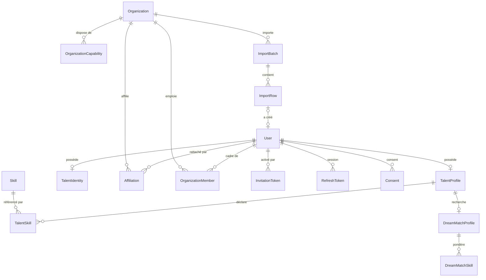
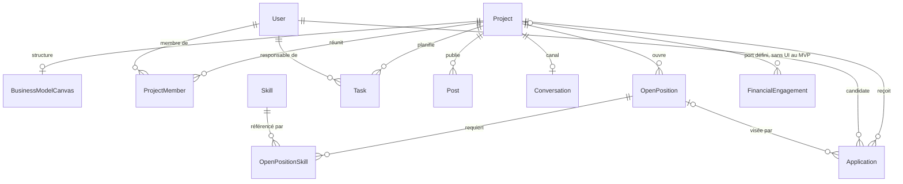
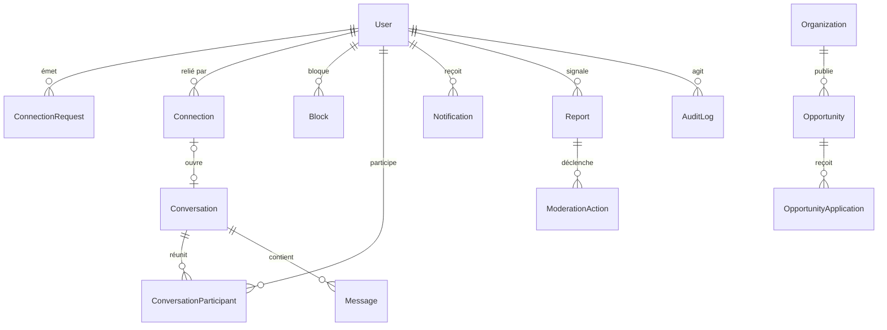

# Modèle de données — MVP CoFound.mg

**Version** : 1.0 — 20 août 2026
**Portée** : MVP uniquement (blocs M1–M13 de [`mvp-scope.md`](./mvp-scope.md))
**32 tables** — aucune spéculative, chacune rattachée à un bloc Must-have.

---

## 1. Principes de modélisation

| # | Principe | Conséquence concrète |
|---|---|---|
| P1 | **L'identité privée est une table séparée** | La donnée privée n'est pas masquée, elle n'est pas chargée (§2) |
| P2 | **JSONB pour ce qui varie légitimement**, jamais pour éviter une migration | BMC et réponses d'onboarding en JSONB ; tout le reste en relationnel strict |
| P3 | **Les référentiels sont en base, avec clés i18n** | Ajouter une filière ou un secteur est une insertion, pas un déploiement |
| P4 | **Tout montant porte sa devise** | Condition de l'extension panafricaine, coût nul aujourd'hui |
| P5 | **L'argent est un agrégat séparé** | `Project` n'a aucun champ `solde` ou `montant_levé` |
| P6 | **Le journal d'audit est en écriture seule** | Aucune mise à jour, aucune suppression |
| P7 | **Les énumérations sont extensibles** | Les 4 états de projet manquants s'ajoutent sans migration de schéma |

---

## 2. La décision structurante : `TalentProfile` / `TalentIdentity`

`TalentProfile` porte tout ce qui est public. `TalentIdentity` porte le nom, la photo, le
téléphone, la région précise et le genre.

> **Ce n'est pas de la coquetterie de schéma. On ne masque pas un champ, on ne le charge pas.**

La requête qui alimente le feed ou une suggestion **ne fait jamais la jointure** vers
`TalentIdentity`. Il n'existe donc aucun chemin par lequel un oubli de sérialisation peut
faire fuiter un nom.

| Approche | Protection |
|---|---|
| Masquage à la sortie | Tient tant que personne n'oublie de l'appliquer |
| **Jointure absente** | **Structurelle — il n'y a rien à oublier** |

C'est aussi ce qui rend l'extraction du genre pour les statistiques propre : une seule table,
un seul dépôt autorisé à la lire, en agrégat avec seuil minimal de 5 individus.

---

## 3. Identité, organisations, affiliations

| Entité | Champs principaux |
|---|---|
| **User** | `email` **(unique)**, `password_hash` (argon2id), `status` ∈ {INVITED, ACTIVE, FROZEN, LEAVING, ALUMNI, DISABLED}, `locale`, `activated_at`, `last_login_at` |
| **TalentProfile** *(public)* | `user_id`, `pseudonym`, `avatar_seed`, `headline`, `bio`, `field_id`, `cohort_year`, `level`, `availability_hours`, `goals[]`, `sectors[]`, `completion`, `visible_in_talent_feed` |
| **TalentIdentity** *(privé)* | `user_id`, `first_name`, `last_name`, `photo_key`, `phone`, `region_id`, **`gender`** *(nullable)* |
| **Organization** | `name`, `type` ∈ {INSTITUTION, INCUBATOR, COMPANY, NGO, PUBLIC, ASSOCIATION}, `country_code`, `logo_key`, `description`, `verification_status` |
| **OrganizationCapability** | `organization_id`, `capability`, `granted_by`, `granted_at` — **une ligne par capacité, accordée par le staff** |
| **OrganizationMember** | `organization_id`, `user_id`, `role` ∈ {ORG_ADMIN, ORG_MANAGER, ORG_VIEWER} |
| **Affiliation** | `user_id`, `organization_id`, **`is_certifying`**, `status` ∈ {ACTIVE, LEAVING, ALUMNI, SUSPENDED}, `field_id`, `cohort_year`, `started_at`, `ended_at` |
| **ImportBatch** | `organization_id`, `uploaded_by`, `file_key`, `status` ∈ {PREVIEW, APPLIED, CANCELLED, FAILED}, `column_mapping` (jsonb), compteurs |
| **ImportRow** | `batch_id`, `line_number`, `raw` (jsonb), `normalized_email`, `result` ∈ {CREATED, UPDATED, SKIPPED_DUPLICATE, ERROR, **BOUNCED**}, `error_code`, `user_id` |
| **InvitationToken** | `user_id`, `token_hash`, `expires_at`, `used_at`, `import_batch_id` |
| **RefreshToken** | `user_id`, `token_hash`, `family_id`, `expires_at`, `revoked_at`, `replaced_by` |
| **Consent** | `user_id`, `purpose`, `policy_version`, `granted_at`, `revoked_at` |
| **DreamMatchProfile** | `talent_id`, `min_availability`, `preferred_team_size`, `institution_pref` ∈ {SAME, ANY, OTHER}, `sectors[]` |
| **DreamMatchSkill** | `dream_id`, `skill_id`, `importance` |

### Points de conception

- **L'unicité de `email` sur `User` est ce qui rend l'import idempotent.** Ré-importer le même
  fichier produit `SKIPPED_DUPLICATE`, jamais un doublon ni une réinitialisation de mot de
  passe.
- **L'affiliation multiple est native** : plusieurs lignes `Affiliation` pour un même
  `user_id`.
- **`is_certifying` n'est vrai que pour les organisations de type `INSTITUTION`** — contrainte
  à faire respecter **en base**, pas seulement en code.
- **`ImportRow.result = BOUNCED`** est écrit par le webhook du service d'email, des heures
  après l'import. C'est ce qui permet à un établissement de voir « 12 adresses invalides » dans
  sa console.
- **`RefreshToken.family_id`** permet de révoquer toute une lignée de jetons quand une
  réutilisation est détectée — le mécanisme qui transforme un vol de jeton en incident détecté.

---

## 4. Projets et collaboration

| Entité | Champs principaux |
|---|---|
| **Project** | `title`, `pitch`, `sector_id`, `region_id`, `status`, `created_by`, `published_at` |
| **BusinessModelCanvas** | `project_id` *(clé)*, `blocks` (jsonb, 9 clés), **`completion`** *(colonne indexée)*, `updated_at`, `updated_by` |
| **ProjectMember** | `project_id`, `user_id`, `role` ∈ {OWNER, MEMBER}, `functional_role`, `joined_at`, `left_at` |
| **OpenPosition** | `project_id`, `title`, `description`, `expected_hours`, `is_open` |
| **Application** | `project_id`, `position_id` *(nullable)*, `applicant_id`, `message`, `status` ∈ {PENDING, ACCEPTED, REJECTED, WITHDRAWN}, `rejection_reason`, `decided_at`, `decided_by` |
| **Task** | `project_id`, `title`, `assignee_id`, `due_date`, `status` ∈ {TODO, DOING, BLOCKED, DONE} |
| **Post** | `project_id`, `type` ∈ {SEEKING_COLLABORATOR, SEEKING_MENTORSHIP, SEEKING_FUNDING, UPDATE}, `content`, `sector_id`, `expires_at` |
| **FinancialEngagement** | `project_id`, `organization_id`, `type`, `amount`, **`currency`**, `status` ∈ {PROPOSED, ACCEPTED, SETTLING, CONFIRMED, REJECTED, CANCELLED}, `provider = OFF_PLATFORM`, `external_ref` |

### Sur le BMC en JSONB

Les 9 blocs sont du texte libre dont la structure interne bougera à chaque itération produit.
Le JSONB évite neuf migrations à chaque ajustement.

`completion` est en revanche **une colonne calculée et indexée**, parce qu'elle sert de
condition au passage en Recrutement et de filtre pour les partenaires.

### Sur `FinancialEngagement`

La table existe, **aucune interface ne l'alimente au MVP**. Ce qui compte n'est pas la table,
c'est la garantie qu'elle porte :

> `Project` n'a **aucun** champ `solde` ou `montant_levé`. L'argent est un agrégat séparé,
> relié au projet, jamais un attribut du projet.

C'est ce qui permettra de brancher un opérateur de paiement en V2 **sans toucher au domaine
projet**. Et `currency` est présent dès la première ligne.

---

## 5. Découverte, mise en relation, opportunités, modération

| Entité | Champs principaux |
|---|---|
| **ConnectionRequest** | `from_user`, `to_user`, `message`, `status` ∈ {PENDING, ACCEPTED, DECLINED, EXPIRED} |
| **Connection** | `user_a`, `user_b` *(paire ordonnée, unique)*, **`revealed_at`**, `source` ∈ {MATCH, PROJECT}, `conversation_id` |
| **Block** | `blocker_id`, `blocked_id`, `created_at` |
| **Conversation** | `type` ∈ {DIRECT, PROJECT}, `project_id` *(nullable)* |
| **ConversationParticipant** | `conversation_id`, `user_id`, `last_read_at` |
| **Message** | `conversation_id`, `author_id`, `body`, `attachment_key`, `created_at` |
| **Opportunity** | `organization_id`, `type` *(seul `CALL_FOR_APPLICATIONS` au MVP)*, `title`, `description`, `eligibility`, `deadline`, `seats`, `status` |
| **OpportunityApplication** | `opportunity_id`, `applicant_type` ∈ {TALENT, PROJECT}, `applicant_id`, `message`, `status` |
| **Report** | `reporter_id`, `target_type`, `target_id`, `reason`, `description`, `status`, `priority`, `assigned_to`, `resolved_at` |
| **ModerationAction** | `report_id`, `actor_id`, `target_user_id`, `action` ∈ {WARNING, FREEZE, DISABLE, CONTENT_REMOVED}, `reason`, `duration_days` |
| **Notification** | `user_id`, `type`, `payload` (jsonb), `read_at` |
| **NotificationPreference** | `user_id`, `type`, `in_app`, `email` |
| **AuditLog** | `actor_id`, `actor_role`, `action`, `target_type`, `target_id`, `metadata` (jsonb), `ip`, `created_at` — **écriture seule** |

### Deux décisions à noter

**Une conversation unique pour les deux usages.** `Conversation.type` distingue le un-à-un du
canal de projet. Un seul modèle de message, un seul mécanisme d'état de lecture, un seul
chemin de signalement. Deux modèles séparés auraient tout dupliqué pour zéro gain.

**Le Feed Talents n'a pas d'entité.** C'est une requête sur `TalentProfile` filtrée par
`visible_in_talent_feed`. Créer une table de publications pour des profils aurait dupliqué la
source de vérité.

---

## 6. Référentiels

| Entité | Champs |
|---|---|
| **Skill** | `slug`, `label_key`, `category`, `is_active`, `sort_order` |
| **Field** *(filière)* | `slug`, `label_key`, `is_active`, `sort_order` |
| **Sector** | `slug`, `label_key`, `is_active`, `sort_order` |
| **Region** | `slug`, `label_key`, `country_code`, `is_active` |

`label_key` est une **clé i18n**, jamais un libellé en dur.

> Ajouter une filière ou un secteur est une insertion en base, pas un déploiement. C'est la
> condition posée pour l'extension panafricaine — et elle a une conséquence immédiate : le
> type `sector` codé en dur dans `ProjectCard.tsx` du prototype disparaît.

---

## 7. Index et contraintes essentiels

| Objet | Raison |
|---|---|
| `User.email` **unique** | Idempotence de l'import |
| `Affiliation (user_id, organization_id)` unique sur les lignes actives | Une seule affiliation active par couple |
| `Connection (user_a, user_b)` unique, paire ordonnée | Évite les doublons symétriques |
| `Application (project_id, applicant_id)` unique sur `PENDING` | Une seule candidature en cours par personne et par projet |
| Contrainte : `is_certifying = true` ⟹ `Organization.type = INSTITUTION` | La valeur du badge dépend de cette règle |
| Index `tsvector` sur `Project(title, pitch)` et `TalentProfile(headline, bio)` | Recherche M5 |
| Index `pg_trgm` sur les libellés de référentiels | Recherche tolérante aux fautes |
| Index sur `BusinessModelCanvas.completion` | Filtre partenaire sur la maturité |
| Index sur `TalentProfile.visible_in_talent_feed` | Feed Talents |
| `AuditLog` : aucun `UPDATE`, aucun `DELETE` accordé au rôle applicatif | Garantie d'inaltérabilité au niveau des droits SQL |

---

## 8. Ce que le modèle rend possible sans migration

| Évolution V2/V3 | Coût |
|---|---|
| Les 4 états de projet manquants | Valeur d'énumération |
| Les autres types d'`Opportunity` (concours, événement, stage) | Valeur d'énumération |
| Affiliations déclaratives des associations | `is_certifying = false` — déjà modélisé |
| Mentorat | `ProjectMember.role = MENTOR` — déjà modélisé |
| Paiement par opérateur | Nouvel adaptateur derrière le port ; `FinancialEngagement.provider` change de valeur |
| Nouveau pays | Insertions dans `Region`, `Field`, `Skill` ; `country_code` déjà présent |
| Nouvelle langue | Fichier de traductions ; `label_key` déjà en place |
| Capacités `SURVEY`, `ANALYTICS`, `FUND` | Ligne dans `OrganizationCapability` |

> **Aucune de ces évolutions ne demande de toucher au schéma existant.** C'est la définition
> pratique de « défendable dans deux ans ».
